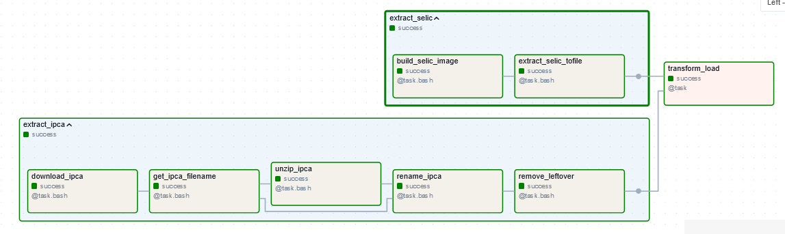

# ETL Pipeline and Data Analysis of Brazilian Interest and Inflation Rates. </br> (ETL Pipeline e Analise de Dados da taxa de juros e inflação do Brasil.)

## Project Description
The main objective of this project is to analyze both the interest rate (taxa selic) and inflation rate (IPCA) of Brazil and possibly create a simple predictive model. To support this, another goal was to create an ETL pipeline.

## Project Summary

This project consists of two main parts: ETL and Data Analysis.  
### ETL
 
An ETL pipeline was developed because the data analysis required pulling data from their respective sources. Therefore, the ETL goals were to:
* retrieve up-to-date data
* clean, transform and create the mothly and annual data
* and load each data into a tsv file.

One of the data sources required the use of Selenium. Since I wanted to reduce the dependencies and isolate this process, I chose to dockerize this step.  
Another data extraction was necessary because the library holidays did not contain all the necessary holidays to accumulate the data over a month or year. The script for this can be found in `scrap/feriados.py`
For the ETL orchestration, I used Airflow for scheduling and monitoring workflows.

### Data Analysis
The conclusion of the data analysis was that there was no significant correlation between Brazillian interest rate and inflation rate, so a model using only these two variables would not be effective.

### More information
The detailed ETL planning can be found in `notebooks/ETL_planning.ipynb` (em português, `notebooks/ETL_planejamento.ipynb`).   
The in-depth data analysis can be found in `notebooks/Data_Analysis.ipynb` (em português, `notebooks/ETL_planejamento.ipynb`).    

You can view these notebooks by using [Jupyter](https://docs.jupyter.org/en/latest/) or [Google Colab](https://colab.research.google.com/). 

## What is next
ETL with AWS.  
A dashboard using dash.  

## Project Structure

```
.
├── Dockerfile
├── README.md
├── dags
│   └── etl_dag.py
├── data
│   ├── feriados.csv
│   ├── selic.tsv
│   ├── selic_ipca_ano.tsv
│   └── selic_ipca_mes.tsv
├── etl-airflow.png
├── etl_scripts
│   ├── __init__.py
│   └── pipeline.py
├── notebooks
│   ├── Analise_de_Dados.ipynb
│   ├── Data_Analysis.ipynb
│   ├── ETL_planejamento.ipynb
│   ├── ETL_planning.ipynb
│   └── requirements-notebooks.txt
├── requirements-airflow.txt
├── scrap
│   ├── scrap_feriados.py
│   └── selic_scrapper
│       ├── requirements.txt
│       └── selic_scrapper.py
├── setup-airflow.sh
└── setup.py
```

## Dictionaries

### Dictionary of the extracted data 
#### Interest Rate (Selic)
| Variável <br/> (Variable) | Descrição <br/> (Description) | 
|---------------------------|--------------------------------|
| reuniao_num               | Ordinal Classification of Copom Meetings <br/>(Classificação ordinal da reunião do Copom) |
| reuniao_data              | Copom meetings date <br/>(Datas das reuniões)   |
| reuniao_vies              | The indicated bias for the upcoming change in the target interest rate. This change may be implemented in accordance with the bias, at any time. <br/> (Indicativo de tendência de mudança da taxa Selic. Essa mudança pode ser feita na meta, na direção do viés, para a taxa Selic a qualquer momento entre as reuniões ordinárias.)     |
| periodo_vigencia          | The time period which the target interest rate is /was in place.<br/> (Periodo em que a meta selic fica vigente.)  |     
| meta_selic_pctaa          | The established annual interest rate, set as a reference.<br/> (Meta de juros (anual) como referência)     |
| tban_pctam                | The Brazillian Central Bank Assistance Rate was an instrument that is charged on loans when banks do not have government bonds to offer as collateral or when they exceed the credit limits of the line that uses the Central Bank's Basic Rate. <br/>(Taxa de Assistência do Banco Central: foi uma taxa cobrada em empréstimos quando bancos não possuem títulos públicos para oferecer como garantia, ou quando superam os limites de crédito da linha que utiliza a Taxa Básica do banco central. A TBAN foi criada em 28/8/96 e extinta em 4/3/99.) |
| taxa_selic_pct            | The weighted and adjusted average of the daily financing transactions calculated by the SELIC (a Special Settlement and Custody System) to the one-day repurchase operations backed by government bonds and accumulated over the period. <br/> (Taxa média ponderada e ajustada dos financiamentos diários apurados no Sistema Especial de Liquidação e de Custódia (Selic) para operações compromissadas de um dia (overnight) lastreadas em títulos públicos federais, acumulada no período. Títulos públicos são títulos emitidos pelo governo federal e são utilizados por ele para se financiar.) |
| taxa_selic_pctaa          | The annual interest rate based on 252 working days <br/>(Taxa selic anualizada com base em 252 dias úteis.)|

#### Inflation Rate (IPCA)

| Variável (Variable)   | Descrição (Description)                                                                                                                                                                                                                            
|-----------------------|------------------------------|
| ano                   | 4-digit numeric Year <br/> (Ano numérico)    |
| mes                   | Three-first-letters of the respective month's name  <br/>(Nome do mês limitado a três letras)    |
| ipca_numero_indice    | Weighted arithmetic average of the 16 monthly average Brazillian metropolitan indeces, computed using the Laspeyres Formula <br/>(Média aritmética ponderada dos 16 índices metropolitanos mensais, que são calculados pela fórmula de Laspeyres.) |       
| ipca_var_mensal       | Monthly variation of the IPCA index over a month <br/> (Variação mensal do índice durante o mês.)  |            
| ipca_var_trimestral   | Quarterly variation of the index considering the last 3 months <br/> (Variação trimestral do índice considerando os últimos 3 meses.)   |
| ipca_var_semetral     | Six-month change in the index over the last 6 months. <br/> (Variação semestral do índice considerando os últimos 6 meses.)    |
| ipca_no_ano           | IPCA index variation in the reference month compared to the index in December of the previous year, for the reference year. <br/> (Variação do índice no mês referência em relação ao índice de dezembro do ano passado ao ano de referência.) |   
| ipca_acumulado_ano    | Annual variation sum over 12 months  <br/> (Soma da variação mensal de 12 meses.)   | 


### Output Data Dictionaries

#### Monthly interest and inflation rates

| Variável <br/> (Variable) | Descrição  <br/>(Description) |
|---------------------------|-------------------------------|
| periodo-mes               | YYYY-MM format month  <br/> (Período no formato YYYY-MM)  |
| mes                       | The first three letters of the respective month <br/> (Mês texto com três letras inicias) |
|  ano                      | 4-digit year<br/> (Ano com 4 dígitos)   |	
| decada                    | 4-digit decade <br/> (Década com 4 dígitos)  |
| meta_acumulada_mes        | Monthly accumulated target interest rate. <br/> (Meta acumulada no mês)    | 
| selic_acumulada_mes       | Monthly accumulated interest rate. <br/> (Selic acumulada no mês)        |
| ipca_mes                  | Monthly Inflation rate.  <br/> (Inflação no mês)|


#### Annual interest and inflation rates

| Variável <br/> (Variable) | Decrição <br/> (Description)                                              |
|---------------------------|------------------------------------------|
| ano                       | 4-digit numeric year <br/>(Ano numérico com 4 digitos)    |
| decada                    | 4-digit numeric decade <br/> (Década numérica com 4 digitos)      | 
| meta_selic_noano          | Annual accumulated target interest rate<br/> (Meta Selic acumulada no ano) |
| selic_acumulada_ano       | Annual accumulated interest rate<br/> (Selic acumulada no ano)            |
| ipca_acumulado_ano        | Annual accumulated inflation rate<br/> (IPCA acumulado no ano )           | 


## How to run the ETL pipeline in Airflow




This is a simple setup and should only be used to test the pipeline.  
The way I designed the ETL requires you to have docker installed.  
You can start by creating a virtual environment either with built-in venv or virtualenv.

```bash
python3 -m venv econvenv
source econvenv/Scripts/activate
```

Then you can run setup_airflow.sh 

```bash
source ./setup-airflow.sh
```

Once the above script is finished, you can check the available dags
```bash
airflow dags list
```

Start the scheduler
```bash
airflow scheduler -D
```

Start the webserver 
```bash
airflow webserver -D
```

Use the standalone version  
```bash
airflow standalone
```
The standalone will generate an user and a password.    
For more information check [Airflow Docs](https://airflow.apache.org/docs/).
