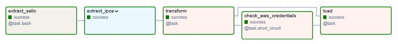

# Analise-Dados-Macroeconomicos </br> (Data Analysis of Brazillian Interest Rate and Inflation Rate)

## Project Description
The main objective of this project is to analyze both the interest rate (taxa selic) and inflation rate (IPCA) of Brazil and possibly create a simple predictive model. 
To perform the analysis, I designed an ETL pipeline to:
* retrieve up-to-date data from official sources
* preprocess the data
* and load into a file 

One of the data sources required the use of Selenium. Since I wanted to reduce the dependencies and isolate this process, I chose dockerize this extraction step.
For the ETL orchestration, I used Airflow for scheduling and monitoring workflows.

The detailed ETL planning can be found in `notebooks/ETL_planning.ipynb` (em português, `notebooks/ETL_planejamento.ipynb`)
The detaileed data analysis and modelling tentative can be found in `notebooks/Data_Analysis.ipynb` file (em português, `notebooks/ETL_planejamento.ipynb`)

You can visualize these notebooks by having [Jupyter](https://docs.jupyter.org/en/latest/) installed or using [Google Colab](https://colab.research.google.com/). 


## Project Summary
This project can be divided into two part:
How the ETL 


## Project Structure

```
.
├── Analise_de_Dados.ipynb
├── Data_Analysis.ipynb
├── Dockerfile
├── ETL_planejamento.ipynb
├── ETL_planning.ipynb
├── README.md
├── dados
│   ├── feriados.csv
│   ├── selic.tsv
│   ├── selic_ipca_ano.tsv
│   ├── selic_ipca_mes.tsv
│   └── selic_transformacao_preliminar.tsv
├── dags
│   └── etl_dag.py
├── etl-airflow.png
├── etl_scripts
│   ├── __init__.py
│   └── pipeline.py
├── requirements_airflow.txt
├── scrap
│   ├── scrap_feriados.py
│   └── selic_scrapper
│       ├── requirements.txt
│       └── selic_scrapper.py
├── setup.py
└── setup_airflow.sh
```

## Dictionaries

### Dictionary of the extracted data 
#### Interest Rate (Selic)
| Variável <br/> (Variable) | Descrição <br/> (Description)                                                                                                                                                                                                                                                                                                                                                                                                                                                                                                                                                                         
|---------------------------|-------------------------------|
| reuniao_num               | Classificação ordinal da reunião do Copom <br/>(Ordinal classification of the Copom's meeting) |
| reuniao_data              | Data da reunião <br/>(Copom meeting's date)  |
| reuniao_vies              | Indicativo de tendência de mudança da taxa Selic. Essa mudança pode ser feita na meta, na direção do viés, para a taxa Selic a qualquer momento entre as reuniões ordinárias. <br/> (The indicated bias for the upcoming change in the target interest rate. This change may be implemented in accordance with the bias, at any time.) |
| periodo_vigencia          | Periodo em que a meta selic fica vigente.<br/> (The time period which the target interest rate is /was in place.) |                                  
| meta_selic_pctaa          | Meta de juros (anual) como referência.<br/> (The established annual interest rate, set as a reference) |
| tban_pctam                | Taxa de Assistência do Banco Central: foi uma taxa cobrada em empréstimos quando bancos não possuem títulos públicos para oferecer como garantia, ou quando superam os limites de crédito da linha que utiliza a Taxa Básica do banco central. A TBAN foi criada em 28/8/96 e extinta em 4/3/99. <br/>(The Brazillian Central Bank Assistance Rate was an instrument that is charged on loans when banks do not have government bonds to offer as collateral or when they exceed the credit limits of the line that uses the Central Bank's Basic Rate.)     |
| taxa_selic_pct            | Taxa média ponderada e ajustada dos financiamentos diários apurados no Sistema Especial de Liquidação e de Custódia (Selic) para operações compromissadas de um dia (overnight) lastreadas em títulos públicos federais, acumulada no período. Títulos públicos são títulos emitidos pelo governo federal e são utilizados por ele para se financiar. <br/> (The weighted and adjusted average of the daily financing transactions calculated by the SELIC (a Special Settlement and Custody System) to the one-day repurchase operations backed by government bonds and accumulated over the period. |
| taxa_selic_pctaa          | Taxa selic anualizada com base em 252 dias úteis. <br/>(The annual interest rate based on 252 working days) |

#### Inflation Rate (IPCA)

| Variável (Variable)   | Descrição (Description)                                                                                                                                                                                                                            
|-----------------------|----------------------------------------------------------------------------------|
| ano                   | Ano numérico <br/> (4-digit numeric Year)                                          |
| mes                   | Nome do mês limitado a três letras  <br/>(Three-first-letters of the respective month's name)    |
| ipca_numero_indice    | Média aritmética ponderada dos 16 índices metropolitanos mensais, que são calculados pela fórmula de Laspeyres. <br/>(Weighted arithmetic average of the 16 monthly average Brazillian metropolitan indeces, computed using the Laspeyres Formula) |       
| ipca_var_mensal       | Variação mensal do índice durante o mês. <br/> (Monthly variation of the IPCA index over a month)  |            
| ipca_var_trimestral   | Variação trimestral do índice considerando os últimos 3 meses. <br/> (Quarterly variation of the index considering the last 3 months)   |
| ipca_var_semetral     | Variação semestral do índice considerando os últimos 6 meses. <br/> (Six-month change in the index over the last 6 months.)    |         
| ipca_no_ano           | Variação do índice no mês referência em relação ao índice de dezembro do ano passado ao ano de referência.<br/> (IPCA index variation in the reference month compared to the index in December of the previous year, for the reference year.) |   
| ipca_acumulado_ano    | Soma da variação mensal de 12 meses. <br/> (Annual variation sum over 12 months )   | 


### Output Data Dictionaries

#### Monthly interest and inflation rates

| Variável <br/> (Variable) | Descrição  <br/>(Description)                                                             |
|---------------------------|-------------------------------------------------------------------------------------------|
| periodo-mes               | Período no formato YYYY-MM  <br/> (YYYY-MM format month)                                  |
| mes                       | Mês texto com três letras inicias <br/> (The first three letters of the respective month) |
|  ano                      | Ano <br/> (4-digit year)                                                                  |	
| decada                    | Década <br/> (4-digit decade)                                                             |
| meta_acumulada_mes        | Meta acumulada no mês <br/> (Monthly accumulated target interest rate.)                   | 
| selic_acumulada_mes       | Selic acumulada no mês <br/> (Monthly accumulated interest rate.)                         |
| ipca_mes                  | Inflação no mês  <br/> (Monthly Inflation rate.)                                          |


#### Annual interest and inflation rates

| Variável <br/> (Variable) | Decrição <br/> (Description)                                              |
|---------------------------|---------------------------------------------------------------------------|
| ano                       | Ano numérico com 4 digitos <br/>(4-digit numeric year)                    |
| decada                    | Década numérica com 4 digitos <br/> (4-digit numeric decade)              | 
| meta_selic_noano          | Meta Selic acumulada no ano<br/> (Annual accumulated target interest rate) |
| selic_acumulada_ano       | Selic acumulada no ano<br/> (Annual accumulated interest rate)            |
| ipca_acumulado_ano        | IPCA acumulado no ano <br/> (Annual accumulated inflation rate)           | 


## How to run the ETL in Airflow



The way I designed the ETL requires you to have docker installed.
You can start by creating a virtual environment using venv or virtualenv

```bash
python3 -m venv econvenv
source econvenv/Scripts/activate
```

Then you can run setup_airflow.sh 

```bash
bash setup-airflow.sh
```

Once the above script is finished, you can check the available dags ys
```bash
airflow dags list
```

You can now create an user and run the airflow webserver or use the standalone version 
```bash
airflow standalone
```
The standalone will generate an user and a password. 
For further information check [Airflow Docs](https://airflow.apache.org/docs/)
